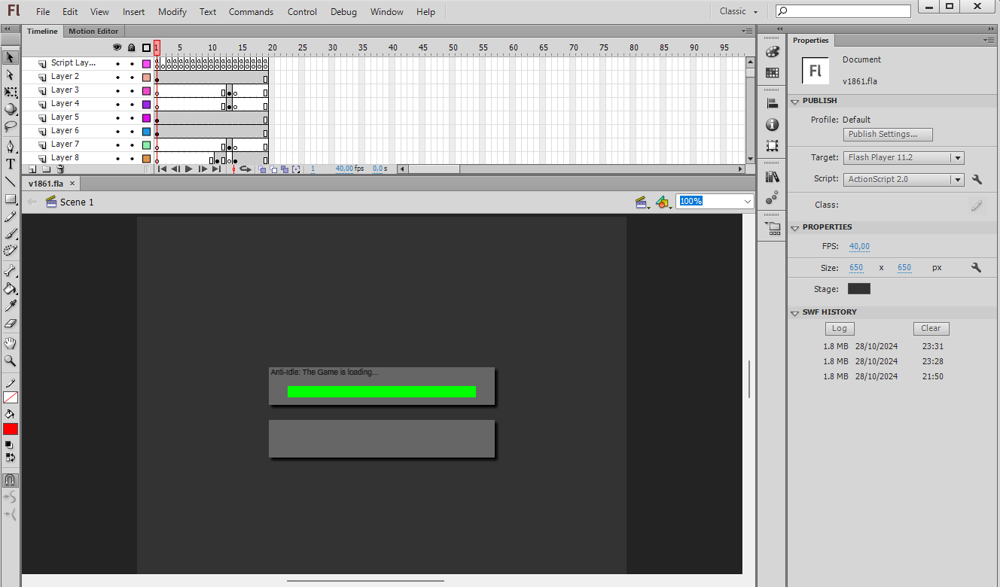
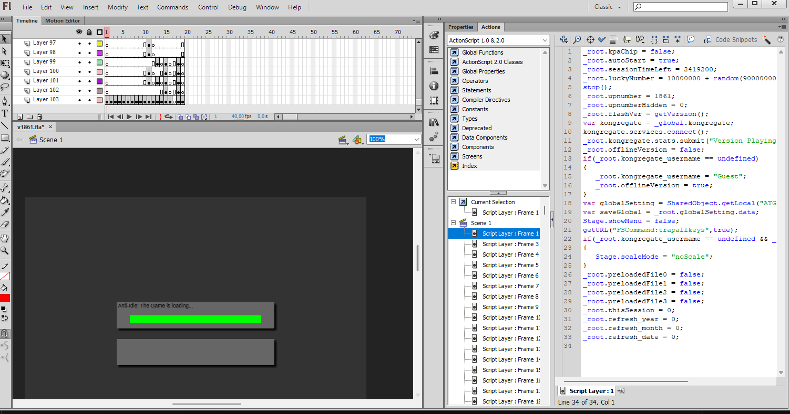
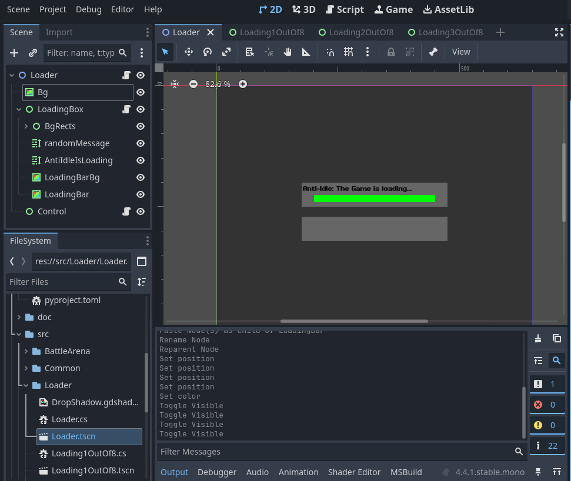

# Anti-Idle: The Game Godot port
Original game made by Tukkun with contributions from many others.

The intention is to port the game from ActionScript to a more modern language and programming engine, so more people can edit the game's code to their needs, and allow for the game to be playable outside of the antiquated Adobe Flash platform.

# How to contribute

The port is written in C#, using the Godot engine.

If you've used ActionScript before, C# is a bit different. It's an object oriented
language, similar to Java. In practice, this means porting has some challenges,
since you can't just define functions and have it work.

The base game also depends on Flash APIs, some which we've replicated in the port,
and some which are hand ported to Godot equivalents.

Microsoft [has a good starter guide on C#](https://learn.microsoft.com/en-us/dotnet/csharp/tour-of-csharp/tutorials/).
Also check out the Learn C# for JavaScript developers section, as that is the
closest thing to ActionScript.

Because you might not be familiar with C# anyways, the following section will
explain some basics.

## C# basics

### Setting up an editor and Godot

First, you'll need to download .NET, the C# runtime. We use the latest
version of C#. See [this guide to download](https://learn.microsoft.com/en-us/dotnet/core/get-started)
on your given platform.

Set up a text editor so you can edit the code confortably. Any editor that supports
LSP (or has an IDE) is good, like [Rider](https://www.jetbrains.com/rider/),
[VSCode](https://code.visualstudio.com/) or [Kate](https://kate-editor.org/fr/).
If you're not really sure, VSCode is a safe pick.

If using VSCode, you'll need to set up the C# Dev Kit extension, which you
can get in the Extensions pane in the left toolbar.

You'll also need to download [Godot](https://godotengine.org/).
Make sure to get the C# version.

### Opening the solution

The main project is contained in the `AntiIdle.sln` file. Open it and your
editor should start working, and set up the related LSP (or IDE) tooling.

Try using it by opening one of the `.cs` files. If using VSCode, see if you can
Ctrl+Click the names to jump around. If that's the case, then your setup is
working.

### Setting up the `decmp` tool

In the `decmp/` directory, you'll find our tool used to help decompilation.
We recommend installing [`uv`](https://docs.astral.sh/uv/) first.
Afterwards, you can run the script with:

```sh
cd decmp
uv run --script main.py
```

The `decmp` tool runs [JPEXS](https://github.com/jindrapetrik/jpexs-decompiler),
the Free Flash Decompiler, to extract information from the base game.

You'll also need to get a copy of the base game `v1861.swf` and place it in
the `decmp` folder. Then run:

```sh
uv run --script main.py generate_db
```

This will generate a `decomp_db.json` file in the folder. With this, now run:

```sh
uv run --script main.py match
```

and this will output the currently ported code.

## Understanding the porting approach

To track progress in our decompilation, we choose to track based on functions
ported. As ActionScript is an interpreted language, it doesn't compile to any
binary code, meaning it's hard to get an "exact" match on the function, which
we can't really do anyways as Flash behaves differently from Godot.

Instead, tracking code ported is a simple binary switch: either the function
is ported, or it's not.

Top-level code, such as in a DoAction, is also counted as a function for
convenience. Some example output of the `match` script:

```
 function frame_4/DoAction.as matches Loader/Loading3OutOf8.cs: 2192 loc
 function frame_4/DoAction.as:addArenaAccessory() matches Common/Globals/Root.cs: 4 loc
 function frame_4/DoAction.as:addArenaArmor() matches Common/Globals/Root.cs: 4 loc
 // ...
Total accuracy of port: 9.8% across 7826 functions
Matched 173 out of 7826 functions
Matched 16431 loc out of 167416 loc
```

Each entry describes which function was matched. In order to match any ported
code to a specific C# file, we use a comment annotation in code.
For example, for the `addArenaAccessory()` function:

```cs
// MATCH: frame_4/DoAction.as:addArenaAccessory()
public void addArenaAccessory(string name, double reqRank, string subtype, double frame, double attack, double speed, double defense, string bonus, string ability, double maxLevel, double expTNL, double enhance, double bonusPow, double sell, double expiry, bool noBonus, bool noLife, bool noRecycle, bool spirit, double crit, double dexterity, double health, string desc, bool noFuse, double level, double exp, bool noUnique, double unob)
{ .. }
```

And for the top-level DoAction:

```cs
// MATCH: frame_4/DoAction.as
public partial class Loading3OutOf8 : Control
{ .. }
```

The annotations can be put anywhere within a file. `decmp match` will find them
and link them to the corresponding file.

The syntax for a path follows the structure of the disassembly folder. In this
example, the DoAction was in the `frame_4` folder in the disassembly, so its
path is `frame_4:DoAction.as`.

To scope to a specific function, add `:functionName()`
after the file name: `frame_4:DoAction.as:addArenaAccessory()`.

Unfortunately, we don't have tracking for assets, so it's done on a case by case
basis for now. I recommend porting assets at the same time you port the code,
so you don't have to go back to it later.

## Basics of code porting

This section will walk you through a full example of porting, along with how
to port assets. I recommend downloading Adobe Flash CS6 for the asset part,
which you can find online.

Let's do an example of porting with the first frame and its related assets.
First, open the `decmp/binary/v1861.fla` project in Adobe Flash CS6.
After clicking OK, you should see something like this:



Press F9 to bring up the "Actions" menu. This contains the same code we exported
with JPEXS earlier. Click on "Script Layer: Frame 1" and you should find the code:



Alternative, you can also look for the code manually, in the exported scripts/
directory in decmp.

Looking around in CS6, you can see that the frame 1 is made up of various
elements. In Flash language, these are known as "MovieClips". Think of a frame
as just a tree of movieclips.

## Porting the initial Frame 1 code to Godot and C #

When porting to Godot, we want to reproduce that same tree, in the Godot scene
tree. In Godot's case, the equivalent to a frame is just a scene.

Open Godot: you can find the scene for this frame in `src/Loader/Loader.tscn`.
After opening it, you should get this screen:



Here, the scene tree is reconstructed from the Flash one. We can find the
associated code if we click the little script icon next to the top-level node,
the Loader. In Godot, you can associate code to any code in the scene tree,
and it will run with the same lifecycle as Flash. This is how we can port the
flash MovieClips.

You might need to set up [associated editor](https://docs.godotengine.org/en/stable/tutorials/editor/external_editor.html)
for Godot to open the files in VSCode or your editor. After this, the `Loader.cs`
file should show up.

### Porting the code to C #

You can find the original frame_1 code.

Here is the file, heavily commented with decompilation
details:

```cs
// C# is a compiled language. If your code is malformed, you will get errors!
// Make sure to fix them.

// For convenience, many functions and classes are automatically imported
// into scope. See the `Usings.cs` file for these. In general, if you
// find yourself writing something over and over, add a convenience function!

// In C#, the using; statement brings things into scope. Godot will bring
// in the related engine.
using Godot;

// Match the namespace to the folder structure. The file is in the src/Loader/
// folder, so we name it AntiIdle.Loader. (The src/ folder is special.)
namespace AntiIdle.Loader;

// In C#, code is stored in classes. To link a C# class to a Godot node, make
// it inherit from a Godot class with the `:` syntax. Here,
// `Loader : Node` means our class, Loader, inherits from Node.
// Godot will generate this for you, if you create the class from Godot.
// MATCH: frame_1/DoAction.as
public partial class Loader : Node
{
	// Many lifecycle functions are defined on Godot nodes, but only two
	// are really relevant for us. The first is _Ready(), which will run
	// code once at startup. This is where you can put outside code.
	public override void _Ready()
	{
		// _root is imported automatically into scope, so you can do
		// `_root.value = thing`. However, note that you might have to add
		// extra properties to _root if they're not present.
		_root.kpaChip = false;
		_root.autoStart = true;
		_root.sessionTimeLeft = 2419200;
		// Most Flash functions are defined in Common/Flash. If you see a
		// missing one, add it!
		_root.luckyNumber = 10000000 + random(90000000);
		stop();
		_root.upnumber = 1861;
		_root.upnumberHidden = 0;
		_root.flashVer = getVersion();
		var kongregate = _global.kongregate;
		kongregate.services.connect();
		_root.kongregate.stats.submit("Version Playing",_root.upnumber);
		_root.offlineVersion = false;
		if(_root.kongregate_username == undefined)
		{
			_root.kongregate_username = "Guest";
			_root.offlineVersion = true;
		}
		var globalSetting = SharedObject.getLocal("ATG_Global","/");
		_root.saveGlobal = _root.globalSetting.data;
		Stage.showMenu = false;
		fscommand("trapallkeys",true);
		if(_root.kongregate_username == undefined && _root.saveGlobal.aurianMode != true)
		{
			Stage.scaleMode = "noScale";
		}
		_root.preloadedFile0 = false;
		_root.preloadedFile1 = false;
		_root.preloadedFile2 = false;
		_root.preloadedFile3 = false;
		_root.thisSession = 0;
		_root.refresh_year = 0;
		_root.refresh_month = 0;
		_root.refresh_date = 0;
	}

	// _Process is a function that runs on every frame, like onEnterFrame.
	public override void _Process(double delta)
	{
	}
}
```

You can find a slightly more complex example by looking at the LoadingBox node:

```cs
using Godot;

// MATCH: DefineSprite_2322/frame_1/DoAction.as
public partial class LoadingBox : Control
{
	// Many movie clips have variables. As a rule of thumb, if there's something
	// like this in the code:
	//  preloadCount = 0;
	// then the variable should be declared as an instance variable.
	private double preloadCount;
	// Get a reference to a child Godot node.
	// Same as in Flash, only that we need to declare the mapping explicitly.
	// Also, you'll need to initialize it in the _Ready() function.
	private RichTextLabel randomMessage;

	// Each ported function will have a separate match annotation.
	// MATCH: DefineSprite_2322/frame_1/DoAction.as:genRandom()
	public void genRandom()
	{
		// Declare a local variable to a function with the var keyword.
		var textToGet = random(11) + 1;
		if (textToGet == 1)
		{
			// This will change the text on the randomMessage node.
			randomMessage.Text = "Did you know? Anti-Idle: The Game is loading!";
		}

		if (textToGet == 2)
		{
			randomMessage.Text = "This is one of 11 messages you can get, LOL!";
		}

		if (textToGet == 3)
		{
			randomMessage.Text = "Don\'t forget to come back and check for updates!";
		}

		if (textToGet == 4)
		{
			randomMessage.Text = "If it takes too long to load or doesn\'t load at all, try refreshing.";
		}

		if (textToGet == 5)
		{
			randomMessage.Text = "Happy Birthday! What, it isn\'t your birthday? Oh well...";
		}

		if (textToGet == 6)
		{
			randomMessage.Text = "Loading epicness...";
		}

		if (textToGet == 7)
		{
			randomMessage.Text = "Finding a way to reduce lag...";
		}

		if (textToGet == 8)
		{
			randomMessage.Text = "Increasing player\'s Impatience Quotient...";
		}

		if (textToGet == 9)
		{
			randomMessage.Text = "The game is fully loaded when the green bar is full, by the way.";
		}

		if (textToGet == 10)
		{
			randomMessage.Text = "Oh, by the way, this isn\'t the game. This is just the preloader!";
		}

		if (textToGet == 11)
		{
			if (_root.kongregate_username != undefined && _root.kongregate_username != "Guest")
			{
				randomMessage.Text = "Someone named " + _root.kongregate_username +
									 " is waiting to play Anti-Idle: The Game!";
			}
			else
			{
				randomMessage.Text = "Don\'t forget, playing with a Kongregate account grants you higher rewards!";
			}
		}
	}

	public override void _Ready()
	{
		// Initialize the node here! The string name will match the name
		// you put for the node in Godot, and it needs to be a child of
		// this node.
		randomMessage = GetNode<RichTextLabel>("randomMessage");
		randomMessage.Text = "";
		preloadCount = 0;
	}

	public override void _Process(double delta)
	{
		preloadCount += 1;
		if (preloadCount > 200)
		{
			preloadCount = 0;
			genRandom();
		}

		if (_root.getBytesLoaded() == _root.getBytesTotal())
		{
			// Equivalent of gotoAndStop() for frames: load a new top level
			// frame. Here, it's loading frame 2.
			GetTree().ChangeSceneToFile("src/Loader/Loading1OutOf8.tscn");
		}
	}
}
```

# Differences from Flash to Godot

## FlashList and List

We use both of these interchangably. Here's when to use them:

- If the code is in `_root.save`, or `_root.saveGlobal`, **always use FlashList**. This is required for load/save code to work.
- Otherwise, it's up to preference. FlashList is a sparse array, which is much slower, so using List is preferred when you can. But sometimes the usage may assume a sparse list, so use FlashList if converting to List is too inconvenient.

## Indexing when using a FlashList

A common pattern in the Flash code is indexing an list, then checking if the element was set by comparing it to undefined:

```js
if (_root.save.arenaZoneKill[100] == undefined)
```

Replace this to:

```cs
if (_root.save.arenaZoneKill.ContainsKey(100))`
```

The FlashList helper class we use doesn't support returning null
on an invalid access, so it returns a default value instead.

## Flash scale

In Godot, all scales are [0, 1]. But in Flash, scales differ based on the object:

- `_alpha`: Is a percentage in Flash, from 0 (transparent) to 100 (opaque). Godot equivalent is `Modulate.A`.
- `color` components: From 0 to 255 in Flash, compared to [0,1] in Godot.
- `_xscale`, `_yscale`: 0 to 100 in Flash, [0,1] in Godot. Godot equivalent is `Scale`.

To solve this, **we have special node types in Godot, use them!** These will import convenience variables `_X`, `_Y`, ... that behave the same as Flash.

- For Node2D: Use `FlashNode2D`.
